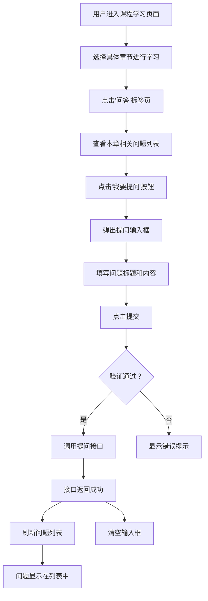
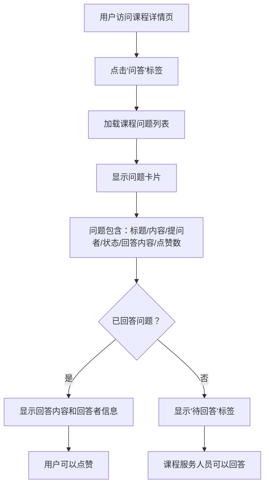
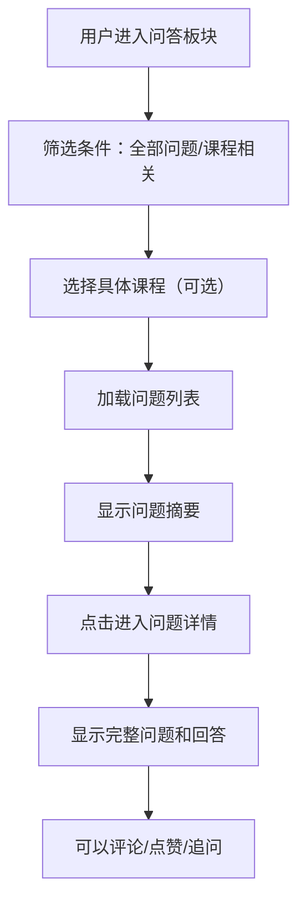

# 课程提问功能需求分析与接口设计说明书

## 一、需求概述

### 1.1 原始需求
> 课程小节详情内可以提问，问题会显示到课程下的提问位置，也会被显示在问答板块的课程问答部分（还有非课程问答）

### 1.2 需求解读
该需求涉及**两个显示场景**和**一个核心功能**：

**两个显示场景：**
1. **课程页面内的提问区**：在课程播放器的"问答"标签页中显示本课程的所有问题
2. **独立问答板块**：平台级的问答社区，包含课程相关问答和非课程类问答

**一个核心功能：**
- 用户在课程小节学习过程中可以随时提问，问题自动关联到具体课程和章节

### 1.3 功能定位
- **模块归属**：课程模块（Course Module）
- **业务场景**：互动学习、答疑解惑
- **用户角色**：普通学员（提问者）、课程服务人员（回答者）、管理员

---

## 二、完整业务流程与交互逻辑

### 2.1 用户交互流程（前端视角）

#### 场景 A：课程小节内提问



#### 场景 B：查看课程问答



#### 场景 C：问答板块查看课程相关问题



### 2.2 数据流转图

```
用户提问请求
    ↓
前端表单验证
    ↓
调用 POST /system/course/question
    ↓
Controller 层（权限校验）
    ↓
Service 层（事务处理）
    ↓
Mapper 层（数据库操作）
    ↓
osh_course_question 表
    ↓
返回问题 ID
    ↓
前端刷新列表
    ↓
同时显示在：
├─ 课程页面的问答区
└─ 问答板块的课程问答区
```

---

## 三、课程模块需要实现的接口清单

根据现有代码库分析，课程模块已实现以下接口，需要进行**增强和优化**：

### 3.1 已实现接口（现状分析）

#### 接口 1：提问接口 ✅

**接口路径：** `POST /system/course/question`

**当前实现：**
```java
@PostMapping("/question")
public R<Long> askQuestion(@RequestBody QuestionDTO questionDTO) {
    Long userId = getUserId();
    Long questionId = courseManageService.askQuestion(questionDTO, userId);
    return R.ok(questionId);
}
```

**参数说明：**
| 参数名 | 类型 | 必填 | 说明 |
|-------|------|-----|------|
| courseId | Long | 是 | 课程 ID |
| sectionId | Long | 否 | 章节 ID（为空表示针对整个课程提问） |
| questionTitle | String | 是 | 问题标题（限 200 字） |
| questionContent | String | 是 | 问题详细描述（限 2000 字） |

**返回值：**
```json
{
  "code": 200,
  "msg": "操作成功",
  "questionId": 1001
}
```

**存在问题：**
1. ❌ 缺少字段长度验证
2. ❌ 缺少敏感词过滤
3. ❌ 缺少重复问题检测
4. ❌ 未返回完整的问题对象（只返回 ID）

---

#### 接口 2：获取课程问答列表 ✅

**接口路径：** `GET /system/course/{courseId}/questions`

**当前实现：**
```java
@GetMapping("/{courseId}/questions")
@Anonymous
public R<List<CourseQuestionVO>> getQuestions(
    @PathVariable Long courseId,
    @RequestParam(required = false) Long sectionId,
    @RequestParam(required = false) String status) {
    return R.ok(courseManageService.getQuestions(courseId, sectionId, status));
}
```

**参数说明：**
| 参数名 | 类型 | 必填 | 说明 |
|-------|------|-----|------|
| courseId | Long | 是 | 课程 ID |
| sectionId | Long | 否 | 章节 ID（用于筛选特定章节的问题） |
| status | String | 否 | 状态筛选：pending/answered/resolved |

**返回值示例：**
```json
{
  "code": 200,
  "msg": "操作成功",
  "data": [
    {
      "id": 1001,
      "sectionTitle": "1.3 生产经营单位的安全生产保障",
      "questionTitle": "安全生产法中的'三同时'制度具体指什么？",
      "questionContent": "老师好，课程中提到了...",
      "askerName": "张同学",
      "answerContent": "'三同时'是指...",
      "answererName": "李讲师",
      "answerTime": "2026-03-25 10:30:00",
      "status": "resolved",
      "likeCount": 12,
      "isTop": true,
      "createTime": "2026-03-24 15:20:00"
    }
  ]
}
```

**存在问题：**
1. ❌ 缺少分页支持（问题多了后性能差）
2. ❌ 缺少排序选项（默认按时间倒序，无法按热度排序）
3. ❌ 缺少关键字搜索功能

---

#### 接口 3：获取问题详情 ✅

**接口路径：** `GET /system/course/question/{questionId}`

**当前实现：**
```java
@GetMapping("/question/{questionId}")
@Anonymous
public R<QuestionDTO> getQuestionDetail(@PathVariable Long questionId) {
    return R.ok(courseManageService.getQuestionDetail(questionId));
}
```

**存在问题：**
1. ❌ 返回类型为 QuestionDTO（用于提交的 DTO），应该使用 VO 对象
2. ❌ 缺少问题详情的扩展信息（如点赞数、评论数、浏览数）

---

#### 接口 4：回答问题 ✅

**接口路径：** `POST /system/course/question/{questionId}/answer`

**当前实现：**
```java
@PostMapping("/question/{questionId}/answer")
@PreAuthorize("@ss.hasPermi('system:course:question:answer')")
public R<Void> answerQuestion(
    @PathVariable Long questionId,
    @RequestBody Map<String, String> params) {
    String answerContent = params.get("answerContent");
    Long userId = getUserId();
    courseManageService.answerQuestion(questionId, answerContent, userId);
    return R.ok();
}
```

**存在问题：**
1. ❌ 参数使用 Map<String, String>，不够规范，应使用 DTO
2. ❌ 缺少回答内容长度验证
3. ❌ 缺少敏感词过滤

---

### 3.2 需要新增的接口

基于需求分析，课程模块还需要实现以下接口：

#### 接口 5：删除问题（新增）

**接口路径：** `DELETE /system/course/question/{questionId}`

**权限要求：** 
- 仅问题创建者本人或课程服务人员可删除
- 需要权限：`system:course:question:delete`

**请求方法：** DELETE

**路径参数：**
| 参数名 | 类型 | 必填 | 说明 |
|-------|------|-----|------|
| questionId | Long | 是 | 问题 ID |

**业务逻辑：**
1. 验证删除权限（本人或课程服务人员）
2. 执行逻辑删除（更新 delete_flag = 1）
3. 清除相关缓存

**返回值：**
```json
{
  "code": 200,
  "msg": "删除成功"
}
```

---

#### 接口 6：点赞问题（新增）

**接口路径：** `POST /system/course/question/{questionId}/like`

**权限要求：** 登录用户

**请求方法：** POST

**路径参数：**
| 参数名 | 类型 | 必填 | 说明 |
|-------|------|-----|------|
| questionId | Long | 是 | 问题 ID |

**业务逻辑：**
1. 检查用户是否已点赞（查询 osh_user_like 表）
2. 如果未点赞：
   - 插入点赞记录
   - 问题点赞数 +1
3. 如果已点赞：
   - 取消点赞（删除点赞记录）
   - 问题点赞数 -1
4. 返回当前点赞状态

**返回值：**
```json
{
  "code": 200,
  "msg": "操作成功",
  "data": {
    "isLiked": true,
    "likeCount": 13
  }
}
```

---

#### 接口 7：置顶问题（新增）

**接口路径：** `POST /system/course/question/{questionId}/pin`

**权限要求：** 
- 仅课程服务人员或管理员
- 需要权限：`system:course:question:manage`

**请求方法：** POST

**路径参数：**
| 参数名 | 类型 | 必填 | 说明 |
|-------|------|-----|------|
| questionId | Long | 是 | 问题 ID |

**请求参数：**
```json
{
  "isTop": true
}
```

**业务逻辑：**
1. 验证权限
2. 更新问题的 is_top 字段
3. 记录操作日志

**返回值：**
```json
{
  "code": 200,
  "msg": "操作成功"
}
```

---

#### 接口 8：标记问题状态（新增）

**接口路径：** `POST /system/course/question/{questionId}/status`

**权限要求：** 
- 仅问题创建者或课程服务人员
- 需要权限：`system:course:question:status`

**请求方法：** POST

**路径参数：**
| 参数名 | 类型 | 必填 | 说明 |
|-------|------|-----|------|
| questionId | Long | 是 | 问题 ID |

**请求参数：**
```json
{
  "status": "resolved"  // pending/answered/resolved
}
```

**业务逻辑：**
1. 验证权限
2. 更新问题状态
3. 如果标记为 resolved，记录解决时间

**返回值：**
```json
{
  "code": 200,
  "msg": "操作成功"
}
```

---

#### 接口 9：批量获取多个课程的问题统计（新增）

**接口路径：** `GET /system/course/questions/statistics`

**权限要求：** Anonymous

**请求方法：** GET

**请求参数：**
| 参数名 | 类型 | 必填 | 说明 |
|-------|------|-----|------|
| courseIds | String | 否 | 课程 ID 集合（逗号分隔，如：1,2,3） |

**业务逻辑：**
1. 解析 courseIds 参数
2. 批量查询每个课程的问题数量
3. 返回统计数据

**返回值示例：**
```json
{
  "code": 200,
  "data": [
    {"courseId": 1, "totalCount": 25, "pendingCount": 3, "answeredCount": 20, "resolvedCount": 2},
    {"courseId": 2, "totalCount": 15, "pendingCount": 1, "answeredCount": 12, "resolvedCount": 2}
  ]
}
```

**应用场景：**
- 课程列表页显示每个课程的问题数量
- 帮助用户选择活跃的课程

---

### 3.3 接口汇总清单

| 序号 | 接口名称 | 请求方法 | URL 路径 | 权限要求 | 实现状态 |
|------|---------|---------|--------|---------|---------|
| 1 | 提问 | POST | /system/course/question | 登录用户 | ✅ 已实现（需优化） |
| 2 | 获取课程问答列表 | GET | /system/course/{courseId}/questions | Anonymous | ✅ 已实现（需增强） |
| 3 | 获取问题详情 | GET | /system/course/question/{questionId} | Anonymous | ✅ 已实现（需优化） |
| 4 | 回答问题 | POST | /system/course/question/{questionId}/answer | system:course:question:answer | ✅ 已实现（需优化） |
| 5 | 删除问题 | DELETE | /system/course/question/{questionId} | system:course:question:delete | ❌ 待实现 |
| 6 | 点赞问题 | POST | /system/course/question/{questionId}/like | 登录用户 | ❌ 待实现 |
| 7 | 置顶问题 | POST | /system/course/question/{questionId}/pin | system:course:question:manage | ❌ 待实现 |
| 8 | 标记问题状态 | POST | /system/course/question/{questionId}/status | system:course:question:status | ❌ 待实现 |
| 9 | 批量获取问题统计 | GET | /system/course/questions/statistics | Anonymous | ❌ 待实现 |

---

## 四、接口详细设计与数据流转

### 4.1 提问接口详细设计

#### 4.1.1 完整请求示例

```javascript
// 前端调用示例
axios.post('/system/course/question', {
  courseId: 10,           // 必填：课程 ID
  sectionId: 103,         // 可选：章节 ID（针对具体小节提问）
  questionTitle: '安全生产法中的"三同时"制度具体指什么？',  // 必填：问题标题
  questionContent: '老师好，课程中提到了"三同时"制度，能否详细解释一下具体包含哪些内容？在实际工作中如何落实？'  // 必填：问题内容
}, {
  headers: {
    'Content-Type': 'application/json',
    'Authorization': 'Bearer eyJhbGc...'
  }
})
```

#### 4.1.2 后端处理流程

```
1. Controller 层（CourseManageController.askQuestion）
   ├─ 获取当前登录用户 ID（getUserId()）
   ├─ 接收 QuestionDTO 参数
   └─ 调用 Service.askQuestion(questionDTO, userId)

2. Service 层（CourseManageServiceImpl.askQuestion）
   ├─ 【验证】检查问题标题是否为空
   ├─ 【验证】检查问题内容是否为空
   ├─ 【验证】检查标题长度（≤200 字符）
   ├─ 【验证】检查内容长度（≤2000 字符）
   ├─ 【过滤】敏感词过滤（调用 SensitiveWordUtils）
   ├─ 【查重】检查是否存在相似问题（可选，调用 Elasticsearch）
   ├─ 【构建参数】Map<String, Object> params
   │   ├─ courseId
   │   ├─ sectionId（可为 null）
   │   ├─ userId
   │   ├─ questionTitle（过滤后的内容）
   │   └─ questionContent（过滤后的内容）
   ├─ 【事务】调用 questionMapper.insertQuestion(params)
   └─ 返回 questionId

3. Mapper 层（OshCourseQuestionMapper.insertQuestion）
   └─ 执行 SQL：
      INSERT INTO osh_course_question (
        course_id, section_id, user_id, question_title, 
        question_content, status, create_time
      ) VALUES (
        #{courseId}, #{sectionId}, #{userId}, #{questionTitle}, 
        #{questionContent}, 'pending', NOW()
      )

4. 返回结果
   └─ R.ok(questionId)
```

#### 4.1.3 数据流转图

```
前端请求
  ↓
[JSON 数据]
{
  "courseId": 10,
  "sectionId": 103,
  "questionTitle": "...",
  "questionContent": "..."
}
  ↓
Controller 参数绑定（@RequestBody QuestionDTO）
  ↓
Service 层验证和过滤
  ↓
构建 Map 参数
  ↓
Mapper 执行 INSERT
  ↓
数据库表 osh_course_question
  ↓
生成自增 ID（如：1001）
  ↓
返回给 Service
  ↓
返回给 Controller
  ↓
返回给前端
{
  "code": 200,
  "msg": "操作成功",
  "questionId": 1001
}
```

---

### 4.2 获取课程问答列表接口详细设计

#### 4.2.1 查询条件组合

```java
// 前端请求示例
GET /system/course/10/questions?sectionId=103&status=answered

// 支持的查询条件组合：
1. 仅 courseId → 返回该课程所有问题
2. courseId + sectionId → 返回该章节下的所有问题
3. courseId + status → 返回该课程指定状态的问题
4. courseId + sectionId + status → 精确查询
```

#### 4.2.2 SQL 查询逻辑

```xml
<!-- 当前实现（OshCourseQuestionMapper.xml） -->
<select id="selectQuestionsByCourseId" resultType="java.util.Map">
    SELECT 
        q.id, q.course_id, q.section_id, q.user_id, 
        q.question_title, q.question_content,
        q.answer_content, q.answer_user_id, q.answer_time, 
        q.status, q.like_count, q.is_top, q.create_time, 
        s.section_title,
        u1.nick_name as asker_name,
        u2.nick_name as answerer_name
    FROM osh_course_question q
    LEFT JOIN osh_course_section s ON q.section_id = s.id
    LEFT JOIN sys_user u1 ON q.user_id = u1.user_id
    LEFT JOIN sys_user u2 ON q.answer_user_id = u2.user_id
    WHERE q.course_id = #{courseId}
    <if test="sectionId != null">
        AND q.section_id = #{sectionId}
    </if>
    <if test="status != null and status != ''">
        AND q.status = #{status}
    </if>
    ORDER BY q.is_top DESC, q.create_time DESC
</select>
```

#### 4.2.3 性能优化建议

**问题：** 当课程问题数量达到数千条时，一次性加载会导致性能问题

**解决方案：**
1. **添加分页支持**（推荐）
   ```java
   // 修改 Service 方法签名
   public TableDataInfo getQuestions(Long courseId, Long sectionId, String status, 
                                     Integer pageNum, Integer pageSize) {
       PageHelper.startPage(pageNum, pageSize);
       List<CourseQuestionVO> list = questionMapper.selectQuestionsByCourseId(...);
       return getDataTable(list);
   }
   ```

2. **添加缓存**（可选）
   ```java
   @Cacheable(value = "course_questions", 
              key = "#courseId + ':' + #sectionId + ':' + #status", 
              expire = 300)
   public List<CourseQuestionVO> getQuestions(...) {
       // ...
   }
   ```

3. **添加索引**（必须）
   ```sql
   CREATE INDEX idx_course_section_status 
   ON osh_course_question(course_id, section_id, status);
   ```

---

### 4.3 课程问答与非课程问答的区别

#### 4.3.1 数据结构对比

| 特性 | 课程问答 | 非课程问答 |
|------|---------|-----------|
| **关联对象** | 必须关联课程（course_id） | 不关联课程 |
| **关联章节** | 可关联具体章节（section_id） | 无章节概念 |
| **可见范围** | 所有用户（Anonymous 权限） | 所有用户 |
| **回答权限** | 课程服务人员 | 任意认证用户 |
| **状态管理** | pending/answered/resolved | open/closed |
| **显示位置** | 课程页面 + 问答板块 | 仅问答板块 |
| **数据库表** | osh_course_question | （独立问答表，未实现） |

#### 4.3.2 显示逻辑

**课程问答的显示规则：**
```
1. 在课程页面显示：
   WHERE course_id = {当前课程 ID}
   
2. 在问答板块显示：
   WHERE course_id IS NOT NULL  -- 所有课程相关的问题
   
3. 筛选特定课程的问题：
   WHERE course_id = {指定课程 ID}
```

**非课程问答的显示规则：**
```
1. 仅在问答板块显示：
   WHERE course_id IS NULL  -- 或者使用独立的问答表
   
2. 分类筛选：
   WHERE category_id = {分类 ID}
```

#### 4.3.3 实现方案对比

**方案 A：复用同一张表（当前方案）**

优点：
- 表结构简单
- 维护成本低
- 易于统一管理

缺点：
- 课程问答和非课程问答混在一起
- 查询时需要区分 course_id 是否为 NULL

**方案 B：使用独立表（推荐）**

```sql
-- 课程问答表（现有）
CREATE TABLE osh_course_question (
    id bigint PRIMARY KEY,
    course_id bigint NOT NULL,
    section_id bigint,
    -- ...其他字段
);

-- 非课程问答表（新建）
CREATE TABLE osh_general_question (
    id bigint PRIMARY KEY,
    category_id bigint,  -- 分类 ID
    user_id bigint NOT NULL,
    title varchar(200) NOT NULL,
    content text NOT NULL,
    -- ...其他字段
);
```

优点：
- 数据隔离清晰
- 各自扩展灵活
- 查询性能更好

缺点：
- 需要维护两张表
- 代码量增加

---

## 五、权限控制设计

### 5.1 权限标识符规划

| 权限标识 | 说明 | 适用角色 |
|---------|------|---------|
| `system:course:question:list` | 查看问题列表 | 所有用户（Anonymous） |
| `system:course:question:detail` | 查看问题详情 | 所有用户（Anonymous） |
| `system:course:question:ask` | 提问 | 登录用户 |
| `system:course:question:answer` | 回答问题 | 课程服务人员 |
| `system:course:question:delete` | 删除问题 | 问题创建者、课程服务人员、管理员 |
| `system:course:question:manage` | 管理问题（置顶/加精） | 课程服务人员、管理员 |
| `system:course:question:status` | 标记问题状态 | 问题创建者、课程服务人员 |
| `system:course:question:like` | 点赞问题 | 登录用户 |

### 5.2 权限验证实现

#### 示例 1：回答问题权限验证

```java
@PostMapping("/question/{questionId}/answer")
@PreAuthorize("@ss.hasPermi('system:course:question:answer')")
@Log(title = "课程问答", businessType = BusinessType.UPDATE)
public R<Void> answerQuestion(
    @PathVariable Long questionId,
    @RequestBody AnswerDTO answerDTO) {
    
    // 额外验证：必须是课程服务人员
    Long userId = getUserId();
    boolean isStaff = courseManageService.isCourseStaff(userId, answerDTO.getCourseId());
    if (!isStaff) {
        throw new ServiceException("只有课程服务人员才能回答问题");
    }
    
    courseManageService.answerQuestion(questionId, answerDTO.getAnswerContent(), userId);
    return R.ok();
}
```

#### 示例 2：删除问题权限验证

```java
@DeleteMapping("/question/{questionId}")
@Log(title = "课程问答", businessType = BusinessType.DELETE)
public R<Void> deleteQuestion(@PathVariable Long questionId) {
    Long userId = getUserId();
    
    // 查询问题信息
    Map<String, Object> question = questionMapper.selectQuestionById(questionId);
    if (question == null) {
        throw new ServiceException("问题不存在");
    }
    
    // 验证权限：本人、课程服务人员、管理员
    Long questionOwnerId = (Long) question.get("user_id");
    Long courseId = (Long) question.get("course_id");
    
    boolean isOwner = userId.equals(questionOwnerId);
    boolean isStaff = courseManageService.isCourseStaff(userId, courseId);
    boolean isAdmin = SecurityUtils.isAdmin(userId);
    
    if (!isOwner && !isStaff && !isAdmin) {
        throw new ServiceException("无权删除该问题");
    }
    
    questionMapper.deleteQuestionById(questionId);
    return R.ok();
}
```

---

## 六、数据验证与异常处理

### 6.1 提问接口的验证规则

```java
@Override
@Transactional(rollbackFor = Exception.class)
public Long askQuestion(QuestionDTO questionDTO, Long userId) {
    // 1. 非空验证
    if (StringUtils.isEmpty(questionDTO.getQuestionTitle())) {
        throw new ServiceException("问题标题不能为空");
    }
    if (StringUtils.isEmpty(questionDTO.getQuestionContent())) {
        throw new ServiceException("问题内容不能为空");
    }
    
    // 2. 长度验证
    if (questionDTO.getQuestionTitle().length() > 200) {
        throw new ServiceException("问题标题不能超过 200 个字符");
    }
    if (questionDTO.getQuestionContent().length() > 2000) {
        throw new ServiceException("问题内容不能超过 2000 个字符");
    }
    
    // 3. 敏感词过滤
    String filteredTitle = SensitiveWordUtils.filterSensitiveWord(questionDTO.getQuestionTitle());
    String filteredContent = SensitiveWordUtils.filterSensitiveWord(questionDTO.getQuestionContent());
    
    if (StringUtils.isEmpty(filteredTitle) || StringUtils.isEmpty(filteredContent)) {
        throw new ServiceException("问题包含敏感词，请修改后重新提交");
    }
    
    // 4. 重复问题检测（可选，使用 Elasticsearch）
    // List<Long> similarQuestions = searchSimilarQuestions(filteredTitle, 3);
    // if (!similarQuestions.isEmpty()) {
    //     throw new ServiceException("存在相似问题，请先查看已有问题");
    // }
    
    // 5. 构建参数并保存
    Map<String, Object> params = new HashMap<>();
    params.put("courseId", questionDTO.getCourseId());
    params.put("sectionId", questionDTO.getSectionId());
    params.put("userId", userId);
    params.put("questionTitle", filteredTitle);
    params.put("questionContent", filteredContent);
    
    questionMapper.insertQuestion(params);
    
    return (Long) params.get("id");
}
```

### 6.2 异常情况对照表

| 异常场景 | 异常类型 | HTTP 状态码 | 用户提示 |
|---------|---------|-----------|---------|
| 问题标题为空 | ServiceException | 400 | "问题标题不能为空" |
| 问题内容为空 | ServiceException | 400 | "问题内容不能为空" |
| 标题超过 200 字 | ServiceException | 400 | "问题标题不能超过 200 个字符" |
| 内容超过 2000 字 | ServiceException | 400 | "问题内容不能超过 2000 个字符" |
| 包含敏感词 | ServiceException | 400 | "问题包含敏感词，请修改后重新提交" |
| 课程不存在 | ServiceException | 404 | "课程不存在" |
| 章节不存在 | ServiceException | 404 | "章节不存在" |
| 未登录 | AuthenticationException | 401 | "请先登录" |
| 重复提交相同问题 | ServiceException | 400 | "您已提过相同的问题" |
| 提问频率过高 | ServiceException | 429 | "提问过于频繁，请稍后再试" |

---

## 七、性能优化与安全考虑

### 7.1 性能优化策略

#### 7.1.1 数据库层面

**索引设计：**
```sql
-- 主键索引（已有）
PRIMARY KEY (`id`)

-- 外键索引
KEY `idx_course_id` (`course_id`),
KEY `idx_section_id` (`section_id`),
KEY `idx_user_id` (`user_id`),

-- 查询条件索引（新增复合索引）
KEY `idx_course_section_status` (`course_id`, `section_id`, `status`),

-- 状态索引
KEY `idx_status` (`status`),

-- 时间索引（用于排序）
KEY `idx_create_time` (`create_time`)
```

**分区表设计（数据量>100 万时考虑）：**
```sql
ALTER TABLE osh_course_question 
PARTITION BY RANGE (YEAR(create_time)) (
    PARTITION p2025 VALUES LESS THAN (2026),
    PARTITION p2026 VALUES LESS THAN (2027),
    PARTITION p2027 VALUES LESS THAN (2028)
);
```

#### 7.1.2 应用层面

**缓存策略：**
```java
// 课程问题列表缓存 5 分钟
@Cacheable(value = "course_questions", 
           key = "'course:' + #courseId + ':section:' + #sectionId + ':status:' + #status", 
           expire = 300)
public List<CourseQuestionVO> getQuestions(Long courseId, Long sectionId, String status) {
    return questionMapper.selectQuestionsByCourseId(courseId, sectionId, status);
}

// 问题详情缓存 10 分钟
@Cacheable(value = "question_detail", 
           key = "'question:' + #questionId", 
           expire = 600)
public QuestionDTO getQuestionDetail(Long questionId) {
    // ...
}
```

**分页查询：**
```java
// 强制分页，防止全表扫描
PageHelper.startPage(pageNum, Math.min(pageSize, 50));  // 限制每页最多 50 条
List<CourseQuestionVO> list = questionMapper.selectQuestionsByCourseId(...);
PageInfo<CourseQuestionVO> pageInfo = new PageInfo<>(list);
return getDataTable(pageInfo);
```

### 7.2 安全考虑

#### 7.2.1 XSS 攻击防护

```java
// 使用 HTML 过滤工具
String safeTitle = Jsoup.clean(questionDTO.getQuestionTitle(), Safelist.basic());
String safeContent = Jsoup.clean(questionDTO.getQuestionContent(), Safelist.relaxed());
```

#### 7.2.2 SQL 注入防护

```java
// 使用 MyBatis 参数化查询（已天然防护）
// ❌ 错误示范（字符串拼接）
String sql = "SELECT * FROM osh_course_question WHERE course_id = " + courseId;

// ✅ 正确方式（参数化查询）
@Select("SELECT * FROM osh_course_question WHERE course_id = #{courseId}")
List<Map<String, Object>> selectQuestions(Long courseId);
```

#### 7.2.3 频率限制

```java
// 使用 Redis 实现分布式限流
@RateLimiter(time = 60, count = 10)  // 60 秒内最多 10 次
public Long askQuestion(QuestionDTO questionDTO, Long userId) {
    // ...
}
```

---

## 八、测试用例设计

### 8.1 功能测试用例

| 用例编号 | 测试场景 | 操作步骤 | 预期结果 |
|---------|---------|---------|---------|
| TC001 | 正常提问 | 1. 进入课程页面<br>2. 点击问答标签<br>3. 填写问题标题和内容<br>4. 点击提交 | 提示"操作成功"，问题显示在列表中，status=pending |
| TC002 | 针对章节提问 | 1. 选择具体章节<br>2. 在章节详情下提问<br>3. 提交 | 问题关联到该章节，sectionId 有值 |
| TC003 | 查看课程问题列表 | 1. 访问课程详情页<br>2. 点击问答标签 | 显示该课程所有问题，按置顶和时间排序 |
| TC004 | 筛选问题 | 1. 选择章节筛选<br>2. 选择状态筛选 | 返回符合条件的问题列表 |
| TC005 | 课程服务人员回答问题 | 1. 以服务人员身份登录<br>2. 选择一个待回答问题<br>3. 填写答案并提交 | 问题状态变为 answered，显示回答内容 |
| TC006 | 点赞问题 | 1. 点击问题下方的点赞按钮 | likeCount+1，再次点击取消点赞 |
| TC007 | 删除自己的问题 | 1. 以提问者身份登录<br>2. 删除自己提的问题 | 问题被软删除（delete_flag=1） |
| TC008 | 无权删除他人问题 | 1. 以普通用户身份登录<br>2. 尝试删除他人问题 | 提示"无权删除该问题" |

### 8.2 边界测试用例

| 用例编号 | 测试场景 | 测试数据 | 预期结果 |
|---------|---------|---------|---------|
| BT001 | 标题最大长度 | 200 个字符 | 提交成功 |
| BT002 | 标题超长 | 201 个字符 | 提示"标题不能超过 200 个字符" |
| BT003 | 内容最大长度 | 2000 个字符 | 提交成功 |
| BT004 | 内容超长 | 2001 个字符 | 提示"内容不能超过 2000 个字符" |
| BT005 | 标题包含敏感词 | "xxx 敏感词 xxx" | 提示"包含敏感词" |
| BT006 | 空标题 | "" | 提示"标题不能为空" |
| BT007 | 空内容 | "" | 提示"内容不能为空" |
| BT008 | 不存在的课程 ID | courseId=999999 | 提示"课程不存在" |

### 8.3 性能测试用例

| 用例编号 | 测试目标 | 并发数 | 持续时间 | 性能指标 |
|---------|---------|-------|---------|---------|
| PT001 | 提问接口响应时间 | 50 TPS | 3 分钟 | P95 < 200ms |
| PT002 | 问题列表查询 | 100 TPS | 5 分钟 | P95 < 300ms |
| PT003 | 数据库连接池压力 | 200 并发 | 10 分钟 | 连接池不耗尽 |

---

## 九、总结与建议

### 9.1 现有接口评估

**已实现功能：** ✅
- 提问接口（基础功能完整）
- 获取课程问题列表（支持筛选）
- 获取问题详情
- 回答问题

**待增强功能：** ⚠️
- 添加字段验证和敏感词过滤
- 添加分页支持
- 添加排序选项
- 添加关键字搜索

**缺失功能：** ❌
- 删除问题
- 点赞问题
- 置顶问题
- 标记问题状态
- 批量问题统计

### 9.2 实现优先级建议

**P0（高优先级）：**
1. 完善现有接口的验证逻辑（敏感词、长度、重复检测）
2. 实现删除问题接口
3. 实现点赞问题接口

**P1（中优先级）：**
1. 添加分页支持
2. 实现标记问题状态接口
3. 实现置顶问题接口

**P2（低优先级）：**
1. 批量问题统计接口
2. 相似问题检测（Elasticsearch）
3. 问题收藏功能

### 9.3 技术债务

1. **DTO/VO混用问题**：getQuestionDetail 返回 QuestionDTO，应改为 QuestionVO
2. **Map 参数传递**：answerQuestion 使用 Map<String, String>，应使用 AnswerDTO
3. **缺少统一异常处理**：各接口异常处理不一致
4. **缺少操作日志**：删除、点赞等操作未记录日志

---

**文档状态：** ✅ 已完成  
**最后更新：** 2026-03-31  
**适用版本：** RuoYi v3.9.0  
**维护团队：** 技术开发部
